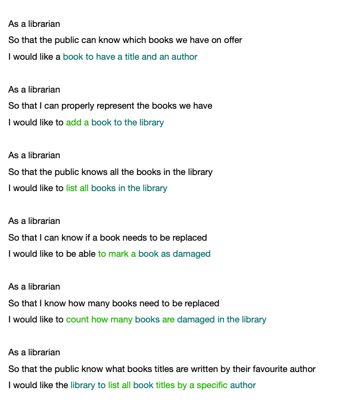
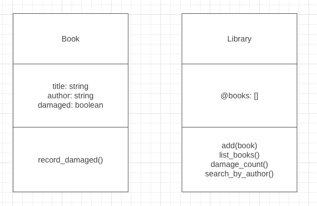

# Practicing Class Diagrams: Library exercise

Task: in pairs, create a Class diagram from the user stories provided, and then translate this into code and test in irb. Reflect on the process.

## User Stories

Actions highlighted green, nouns highlighted blue to help structure the Class diagram

## Class Diagram

## Reflection

I really enjoyed the process of creating a class diagram as a start off point. It forced us to look at how to seperate objects out into Classes, and review how they will interact with eachother. I can see how this could be really beneficial when working in a pair/ team as it helps clarify the overal goals and can act as a sounding board when devs have different ideas of implementation. As a visual person, being able to see all the user stories summarised in one space is really helpful. I will certainly be using this again!